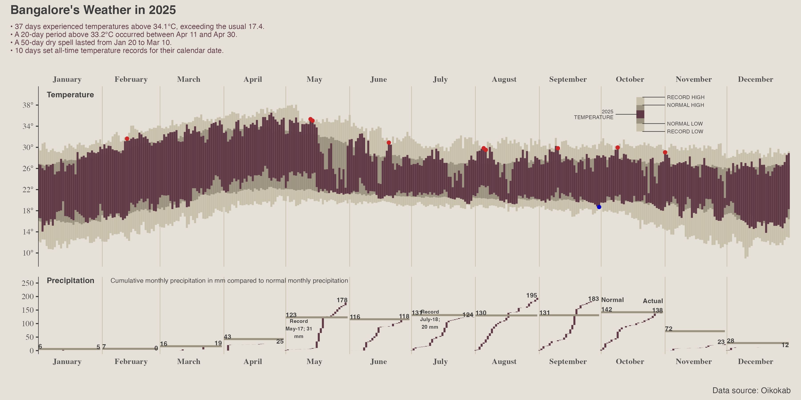
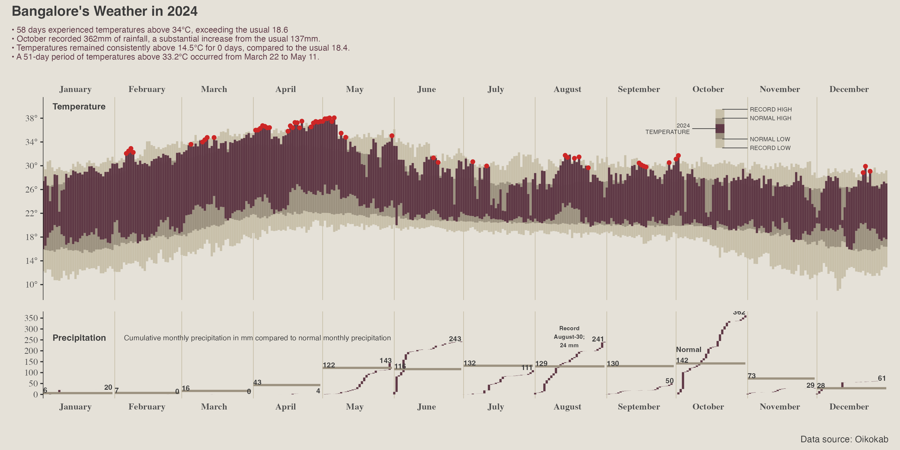
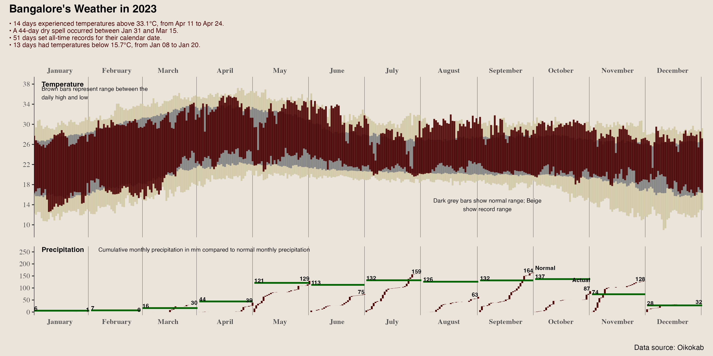
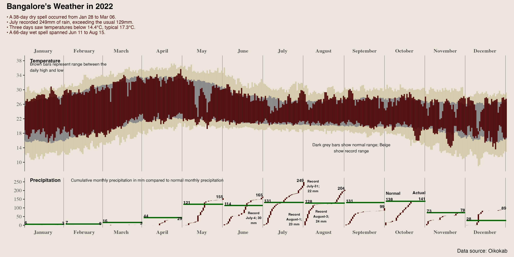
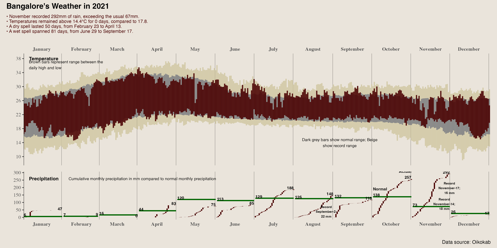

# Bangalore Weather

Temperature and rainfall visualizations for Bangalore (Bengaluru), using hourly weather data from 1981 to present via the [Oikolab](https://oikolab.com/) API.

## What's here

**`bangalore_weather_update.R`** — Downloads the latest hourly temperature and precipitation data from Oikolab, appends it to the local `.RData` files, and produces a chart for the current year.

**`bangalore_weather_historical.R`** — Generates year-by-year weather charts for any past year. Each chart includes:

- **Temperature panel**: Daily high/low range for the target year (brown), overlaid on the normal range (grey) and all-time record range (beige). Days that broke historical records are labelled.
- **Rainfall panel**: Cumulative monthly precipitation (brown bars) compared to the historical monthly average (green step line). Record rainfall days and wettest months are labelled.
- **AI commentary**: 4 bullet points highlighting the most notable weather patterns for that year, generated by a local LLM (Ollama) from pre-computed statistics.

The commentary works by having R compute ~30 weather statistics (hot/cold day counts, streak lengths, rainfall totals, etc.), rank them by how far they deviate from historical averages, and send the top 5 to a local Gemma 3 4B model for concise rephrasing. This keeps LLM usage minimal — the model just reformats pre-selected facts rather than doing any analysis.

Temperature thresholds for "hot days", "cold days", etc. are data-driven (historical percentiles), not hardcoded.

## Charts

### 2025


### 2024


### 2023


### 2022


### 2021


## Requirements

- R with packages: `tidytable`, `tidyverse`, `patchwork`, `lubridate`, `ggthemes`, `ggrepel`, `httr2`, `jsonlite`
- [Ollama](https://ollama.com/) running locally with `gemma3:4b` pulled (for AI commentary; charts render fine without it)
- For `bangalore_weather_update.R`: an [Oikolab](https://oikolab.com/) API key in `~/.Renviron`

## Usage

```r
# Generate a single year's chart
source("bangalore_weather_historical.R")
generate_weather_chart(2024, save_path = "bangalore_weather_2024.png")
```

```bash
# Generate multiple years from the command line
Rscript bangalore_weather_historical.R 2021 2022 2023 2024 2025
```

## Data

The underlying hourly data (`bangaloreTemperature.RData`, `bangaloreRainfall.RData`) is not included in this repo due to size. Run `bangalore_weather_update.R` to fetch and build the data files.

## Design

Chart design inspired by the NYT/Tufte style — minimal gridlines, muted earth-tone palette, data-ink focused. Uses `ggthemes::theme_tufte()` as a base.
