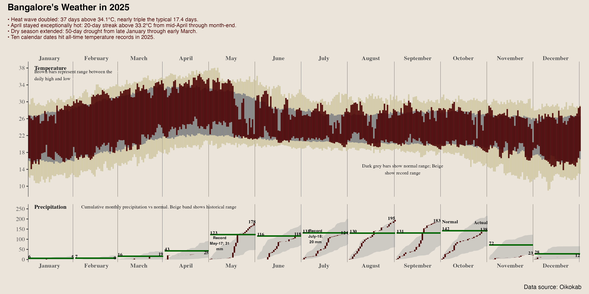
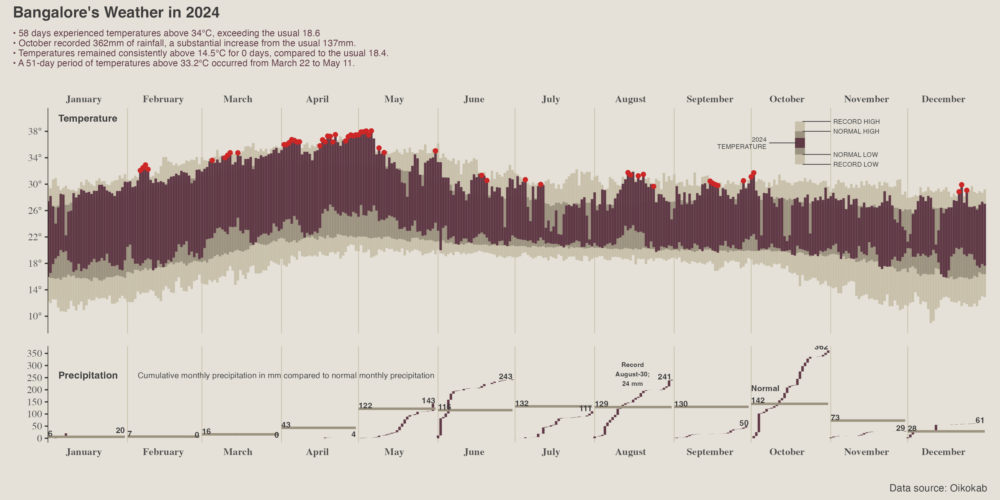
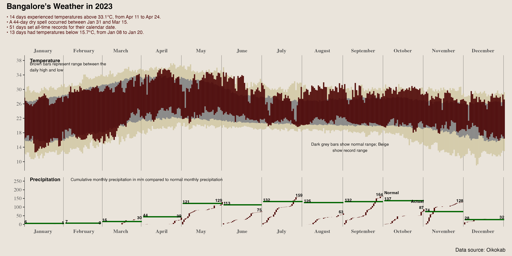
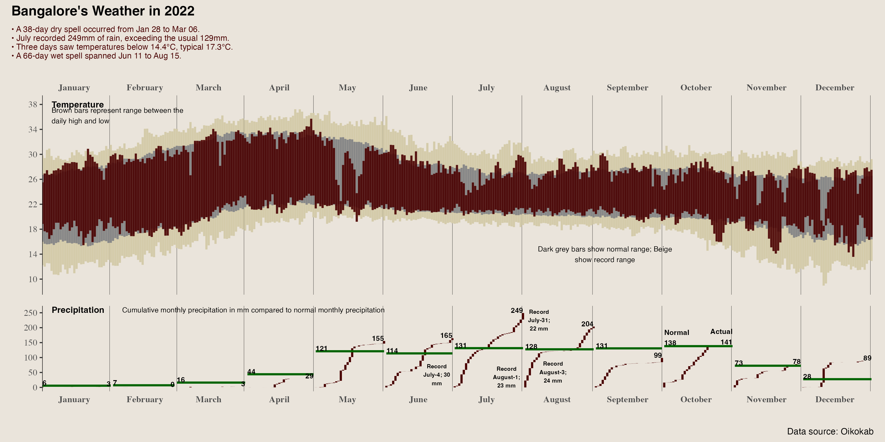
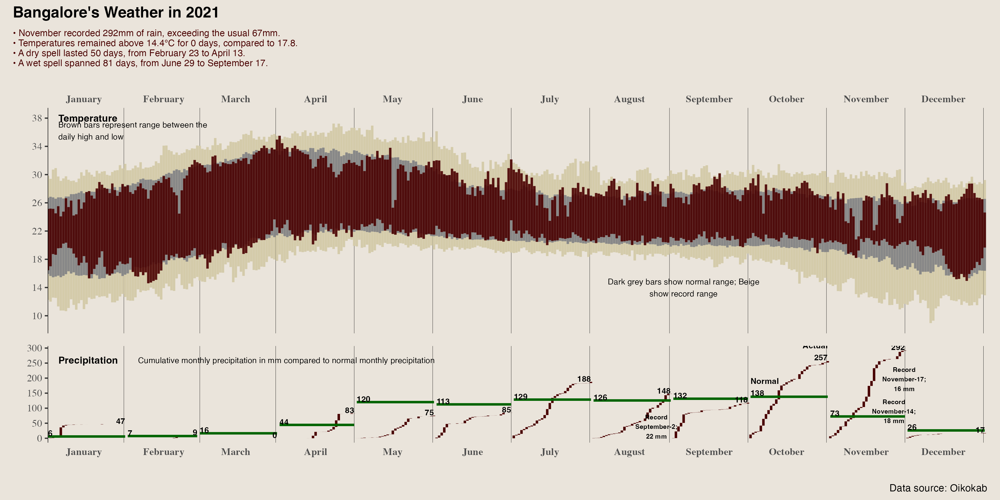

# Bangalore Weather

Temperature and rainfall visualizations for Bangalore (Bengaluru), using hourly weather data from 1981 to present via the [Oikolab](https://oikolab.com/) API.

## What's here

**`bangalore_weather_update.R`** -Downloads the latest hourly temperature and precipitation data from Oikolab, appends it to the local `.RData` files, and produces a chart for the current year. Includes a 3-bullet AI commentary summarising the last 2 weeks of weather compared to historical norms. Skips the API fetch gracefully if data is already up to date.

**`bangalore_weather_historical.R`** -Generates year-by-year weather charts for any past year. Each chart includes:

- **Temperature panel**: Daily high/low range for the target year (brown), overlaid on the normal range (grey) and all-time record range (beige). Days that broke historical records are labelled.
- **Rainfall panel**: Cumulative monthly precipitation (brown bars) compared to the historical monthly average (green step line). Record rainfall days and wettest months are labelled.
- **AI commentary**: 4 bullet points highlighting the most notable weather patterns for that year, generated by Claude (Haiku) from pre-computed statistics.

The commentary works by having R compute ~30 weather statistics (hot/cold day counts, streak lengths, rainfall totals, etc.), rank them by how far they deviate from historical averages, and send the top 5 to Claude Haiku for concise rephrasing. The LLM's role is minimal - it synthesises pre-selected facts into readable bullets rather than doing any analysis.

Temperature thresholds for "hot days", "cold days", etc. are data-driven (historical percentiles), not hardcoded.

Both scripts resolve their own directory at runtime (`sys.frame(1)$ofile` when `source()`'d, `--file=` when run via `Rscript`, `rstudioapi` in RStudio), so they work regardless of working directory.

## Charts

### 2025


### 2024


### 2023


### 2022


### 2021


## GitHub Pages

Static HTML artifacts intended for browser viewing can be published from the `docs/` folder with GitHub Pages.

- Landing page: `docs/index.html`
- Few-shot review cards: `docs/fewshot_annotations/review_cards.html`

## Question-driven analyses

Use `analysis_questions/question_template.Rmd` when a new weather question needs a
notebook-backed answer. If the result is genuinely worth keeping, add it to
`analysis_questions/analyses.yml` with `insightful: true` and `publish: true`, then run:

```bash
Rscript analysis_questions/update_site_analyses.R
```

That regenerates the homepage blog cards in `docs/index.html` using the same article
format as the existing site. If the entry has a `blog_url`, the card points to the
corresponding post instead of directly to the chart.

Blog posts live in `docs/blog/`. Each post must include the visible disclosure
`This post is AI-written.` at the top of the article body and should be added to
`docs/blog/feed.xml`.

## Requirements

- R with packages: `tidytable`, `tidyverse`, `patchwork`, `lubridate`, `ggthemes`, `ggrepel`, `httr2`, `jsonlite`, `yaml`, `rmarkdown`
- An [Anthropic API key](https://console.anthropic.com/) in `~/.Renviron` as `ANTHROPIC_API_KEY` (for AI commentary; charts render fine without it)
- For `bangalore_weather_update.R`: an [Oikolab](https://oikolab.com/) API key in `~/.Renviron`

## Usage

```r
# Generate a single year's chart
source("bangalore_weather_historical.R")
generate_weather_chart(2024, save_path = "bangalore_weather_2024.png")
```

```bash
# Generate multiple years from the command line
Rscript bangalore_weather_historical.R 2021 2022 2023 2024 2025
```

## Data

The underlying hourly data (`bangaloreTemperature.RData`, `bangaloreRainfall.RData`) is not included in this repo due to size. Run `bangalore_weather_update.R` to fetch and build the data files.

## Design

Chart design inspired by the NYT/Tufte style -minimal gridlines, muted earth-tone palette, data-ink focused. Uses `ggthemes::theme_tufte()` as a base.
