# Few-Shot Weather Situation Cards

These are candidate training examples for improving the Bangalore weather subtitle annotations.
Each example is a real historical window chosen to teach a different editorial decision, and the window length varies with the signal.

## How To Use This

For each example, fill in:
- `Your headline`
- `What Claude should learn`

Keep the headline to one line. The purpose is to teach framing, not to draft all three live bullets.

## Situation Families

- **Dry spell broken by a sharp burst**: One short rain episode arrives after a long preceding dry run. The story is the break, not the total.
- **Sustained wet stretch**: Rain is distributed across many days, not concentrated in one spike. A longer window is needed so the persistence is visible.
- **Rain concentrated into one short spell**: A period looks wet on total rainfall, but nearly all of it comes from one brief burst. Shorter framing prevents one burst from being misread as a wet fortnight.
- **Persistently dry window**: Dryness itself is the main signal, relative to what is normal for the season. A wider window is useful because absence is cumulative.
- **Daytime heat spell**: High temperatures sit well above normal for several consecutive days. The run-length matters more than any single hottest day.
- **Warm-night run**: Night temperatures stay unusually elevated even if daytime highs are not extreme. This needs enough days for the night pattern to be unmistakable.
- **Cool daytime spell**: Highs run meaningfully below normal for a sustained stretch. This is about persistent daytime coolness, not a one-day dip.
- **Cool-night run**: Night temperatures stay below normal for several days. The window is chosen to preserve the night-time pattern.
- **Record-heavy patch**: Several days in the window broke prior calendar-date records. The record cluster is the editorial hook.
- **Wet month building through accumulation**: The signal is cumulative rainfall excess over a month, not one isolated day. A 30-day view is needed because the anomaly accumulates.
- **Dry month building through accumulation**: The signal is a running monthly rainfall shortfall. A 30-day view is needed because the deficit builds gradually.
- **Heat-to-rain whiplash**: The same window contains meaningful heat and then a clear rain break. The chosen span keeps both parts of the story visible.

## Example Cards

### Example 01 — Dry spell broken by a sharp burst

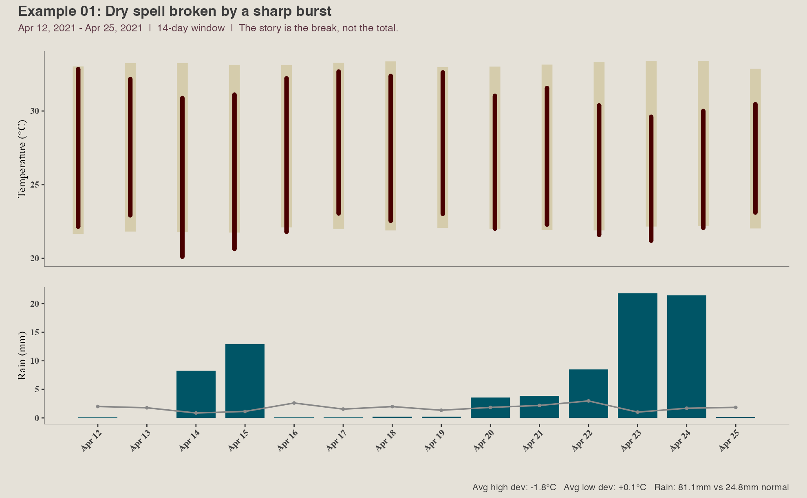

- Window: Apr 12, 2021 to Apr 25, 2021
- Situation: Dry spell broken by a sharp burst
- Why this case matters: Totals alone are misleading; the key is the sudden break after dryness.
- Why this window length: The story is the break, not the total.
- Facts to read: Rain 81.1mm vs 24.8mm normal; avg high dev -1.8°C; avg low dev +0.1°C; rainy days 10; wettest 3-day stretch 51.7mm; antecedent dry streak 51 days; record days 0
- Your headline:

- What Claude should learn:

### Example 02 — Sustained wet stretch

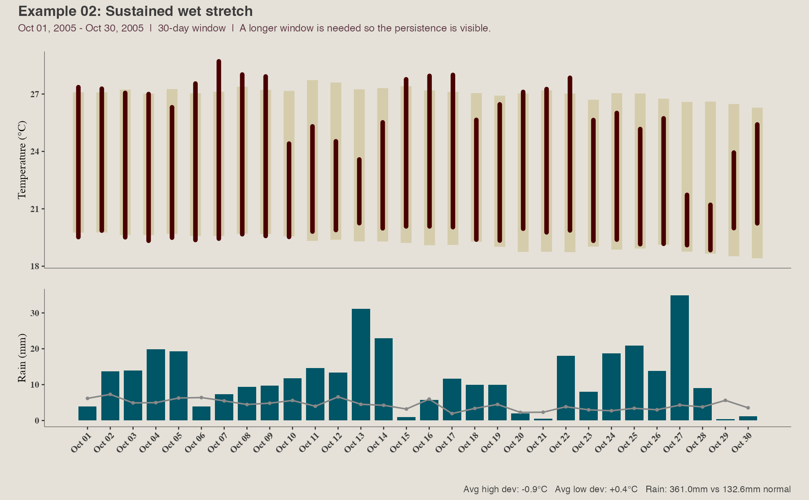

- Window: Oct 01, 2005 to Oct 30, 2005
- Situation: Sustained wet stretch
- Why this case matters: This teaches the model to recognise persistence rather than a single heavy day.
- Why this window length: A longer window is needed so the persistence is visible.
- Facts to read: Rain 361.0mm vs 132.6mm normal; avg high dev -0.9°C; avg low dev +0.4°C; rainy days 30; wettest 3-day stretch 69.7mm; antecedent dry streak 0 days; record days 0
- Your headline:

- What Claude should learn:

### Example 03 — Rain concentrated into one short spell

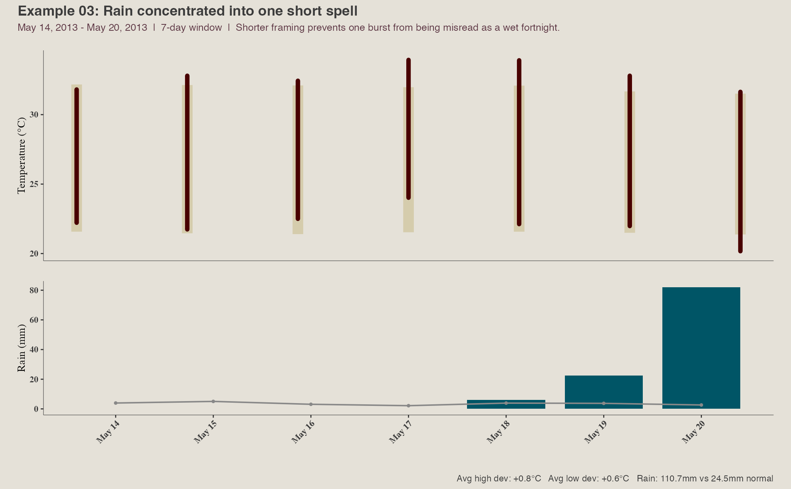

- Window: May 14, 2013 to May 20, 2013
- Situation: Rain concentrated into one short spell
- Why this case matters: This teaches the model not to call a window broadly wet when the rain is concentrated.
- Why this window length: Shorter framing prevents one burst from being misread as a wet fortnight.
- Facts to read: Rain 110.7mm vs 24.5mm normal; avg high dev +0.8°C; avg low dev +0.6°C; rainy days 3; wettest 3-day stretch 110.6mm; antecedent dry streak 5 days; record days 0
- Your headline:

- What Claude should learn:

### Example 04 — Persistently dry window

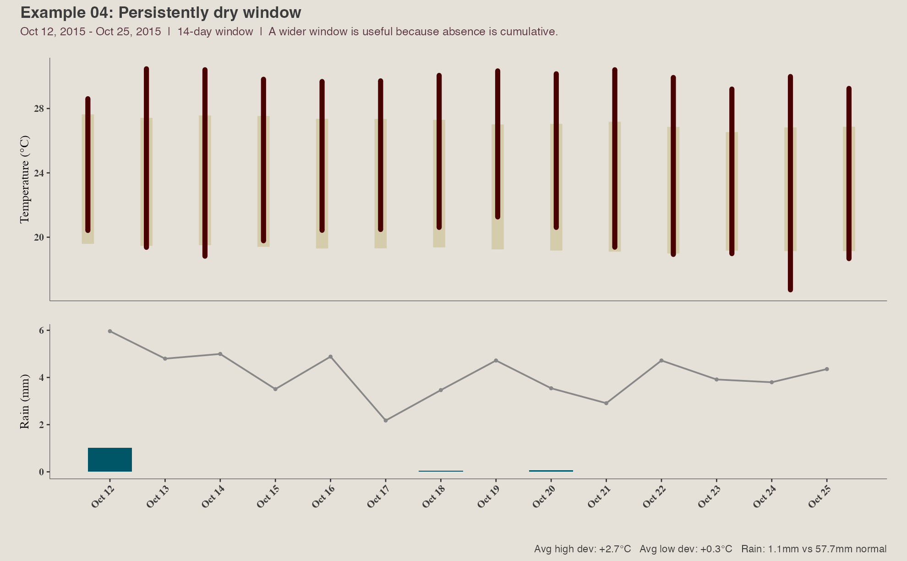

- Window: Oct 12, 2015 to Oct 25, 2015
- Situation: Persistently dry window
- Why this case matters: This teaches the model to treat absence of rain as a real signal.
- Why this window length: A wider window is useful because absence is cumulative.
- Facts to read: Rain 1.1mm vs 57.7mm normal; avg high dev +2.7°C; avg low dev +0.3°C; rainy days 1; wettest 3-day stretch 1.0mm; antecedent dry streak 0 days; record days 9
- Your headline:

- What Claude should learn:

### Example 05 — Daytime heat spell

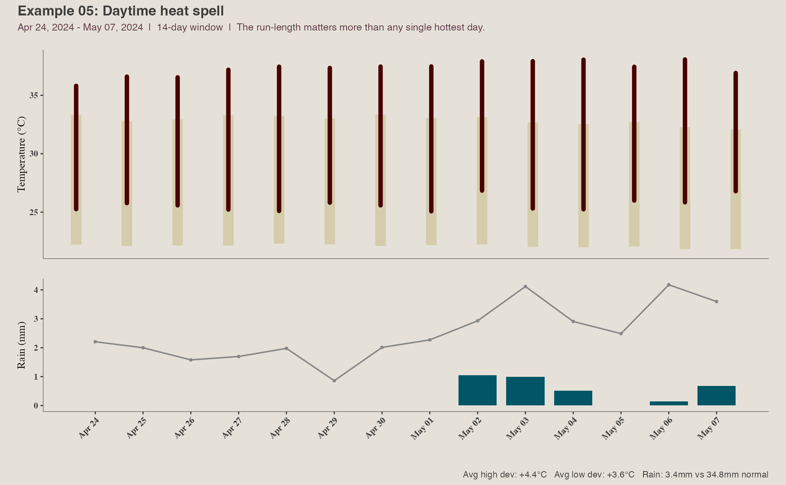

- Window: Apr 24, 2024 to May 07, 2024
- Situation: Daytime heat spell
- Why this case matters: This teaches the model to prioritise a clear daytime heat run.
- Why this window length: The run-length matters more than any single hottest day.
- Facts to read: Rain 3.4mm vs 34.8mm normal; avg high dev +4.4°C; avg low dev +3.6°C; rainy days 5; wettest 3-day stretch 2.5mm; antecedent dry streak 12 days; record days 11
- Your headline:

- What Claude should learn:

### Example 06 — Warm-night run

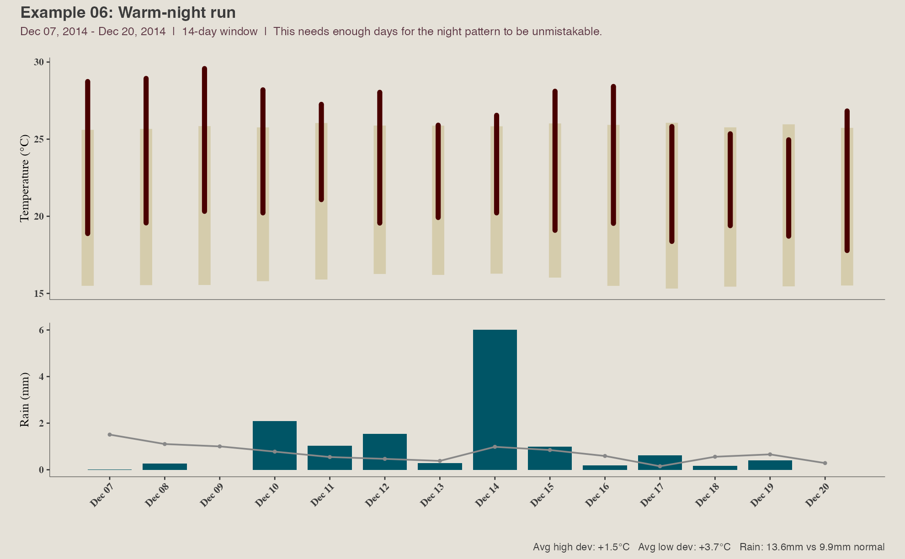

- Window: Dec 07, 2014 to Dec 20, 2014
- Situation: Warm-night run
- Why this case matters: This teaches the model not to miss elevated night temperatures when highs are less dramatic.
- Why this window length: This needs enough days for the night pattern to be unmistakable.
- Facts to read: Rain 13.6mm vs 9.9mm normal; avg high dev +1.5°C; avg low dev +3.7°C; rainy days 11; wettest 3-day stretch 7.8mm; antecedent dry streak 8 days; record days 3
- Your headline:

- What Claude should learn:

### Example 07 — Cool daytime spell

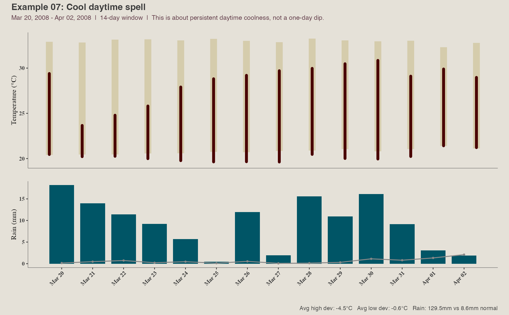

- Window: Mar 20, 2008 to Apr 02, 2008
- Situation: Cool daytime spell
- Why this case matters: This teaches the model to spot sustained cool highs relative to normal.
- Why this window length: This is about persistent daytime coolness, not a one-day dip.
- Facts to read: Rain 129.5mm vs 8.6mm normal; avg high dev -4.5°C; avg low dev -0.6°C; rainy days 14; wettest 3-day stretch 43.5mm; antecedent dry streak 3 days; record days 0
- Your headline:

- What Claude should learn:

### Example 08 — Cool-night run

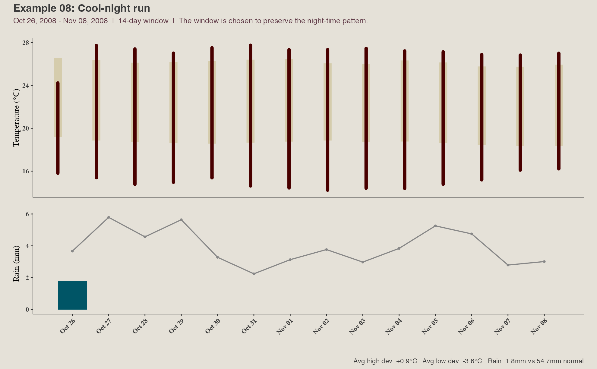

- Window: Oct 26, 2008 to Nov 08, 2008
- Situation: Cool-night run
- Why this case matters: This teaches the model to separate cool nights from cool days.
- Why this window length: The window is chosen to preserve the night-time pattern.
- Facts to read: Rain 1.8mm vs 54.7mm normal; avg high dev +0.9°C; avg low dev -3.6°C; rainy days 1; wettest 3-day stretch 1.8mm; antecedent dry streak 0 days; record days 9
- Your headline:

- What Claude should learn:

### Example 09 — Record-heavy patch

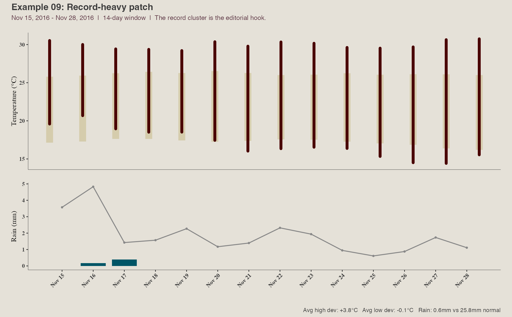

- Window: Nov 15, 2016 to Nov 28, 2016
- Situation: Record-heavy patch
- Why this case matters: This teaches the model to foreground records when they cluster.
- Why this window length: The record cluster is the editorial hook.
- Facts to read: Rain 0.6mm vs 25.8mm normal; avg high dev +3.8°C; avg low dev -0.1°C; rainy days 2; wettest 3-day stretch 0.6mm; antecedent dry streak 2 days; record days 14
- Your headline:

- What Claude should learn:

### Example 10 — Wet month building through accumulation

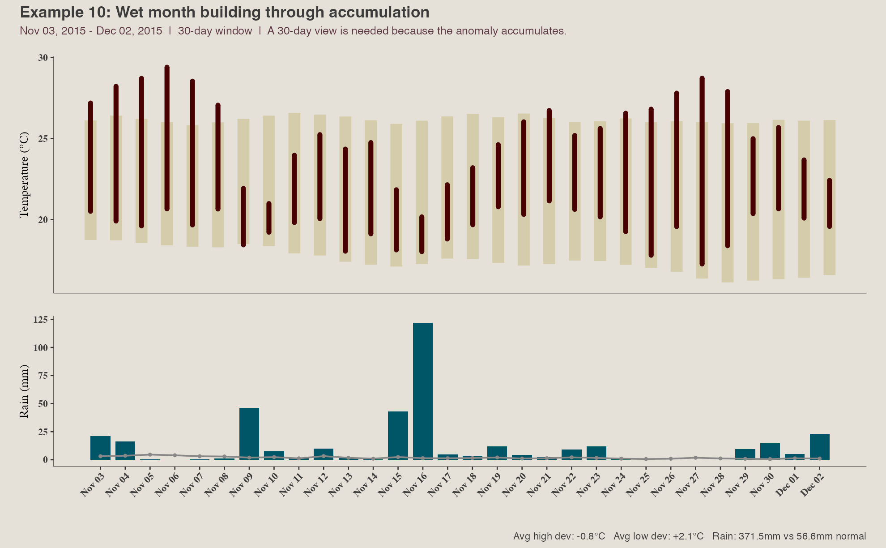

- Window: Nov 03, 2015 to Dec 02, 2015
- Situation: Wet month building through accumulation
- Why this case matters: This teaches the model that some stories are cumulative and need a month-long frame.
- Why this window length: A 30-day view is needed because the anomaly accumulates.
- Facts to read: Rain 371.5mm vs 56.6mm normal; avg high dev -0.8°C; avg low dev +2.1°C; rainy days 25; wettest 3-day stretch 169.8mm; antecedent dry streak 0 days; record days 1
- Your headline:

- What Claude should learn:

### Example 11 — Dry month building through accumulation

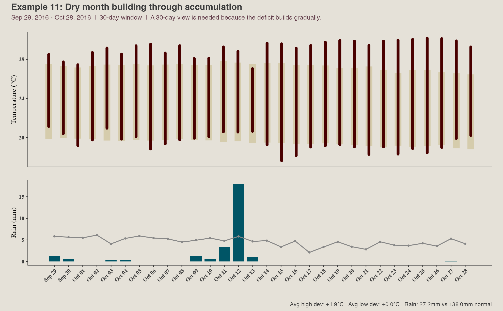

- Window: Sep 29, 2016 to Oct 28, 2016
- Situation: Dry month building through accumulation
- Why this case matters: This teaches the model that rainfall deficits often need a month-long frame.
- Why this window length: A 30-day view is needed because the deficit builds gradually.
- Facts to read: Rain 27.2mm vs 138.0mm normal; avg high dev +1.9°C; avg low dev +0.0°C; rainy days 9; wettest 3-day stretch 22.5mm; antecedent dry streak 0 days; record days 6
- Your headline:

- What Claude should learn:

### Example 12 — Heat-to-rain whiplash

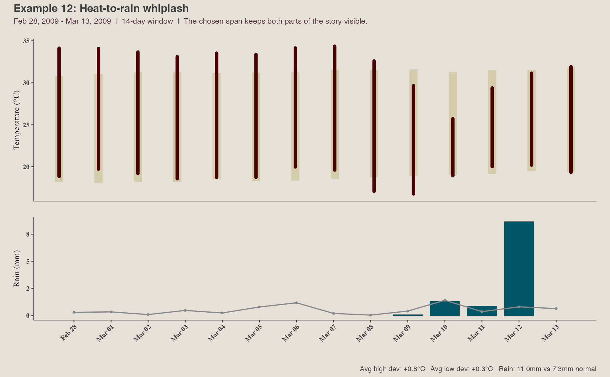

- Window: Feb 28, 2009 to Mar 13, 2009
- Situation: Heat-to-rain whiplash
- Why this case matters: This teaches the model to keep two linked signals in view instead of flattening them.
- Why this window length: The chosen span keeps both parts of the story visible.
- Facts to read: Rain 11.0mm vs 7.3mm normal; avg high dev +0.8°C; avg low dev +0.3°C; rainy days 4; wettest 3-day stretch 10.9mm; antecedent dry streak 60 days; record days 5
- Your headline:

- What Claude should learn:

